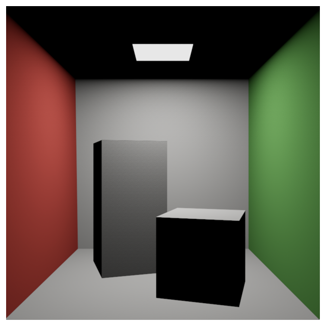
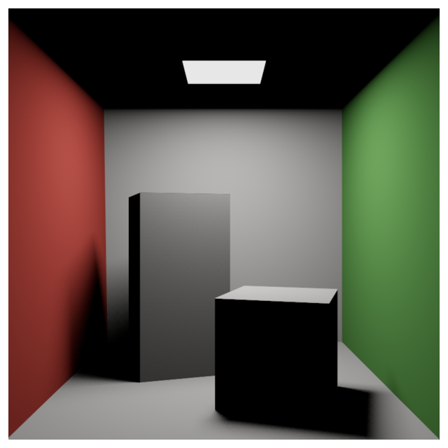
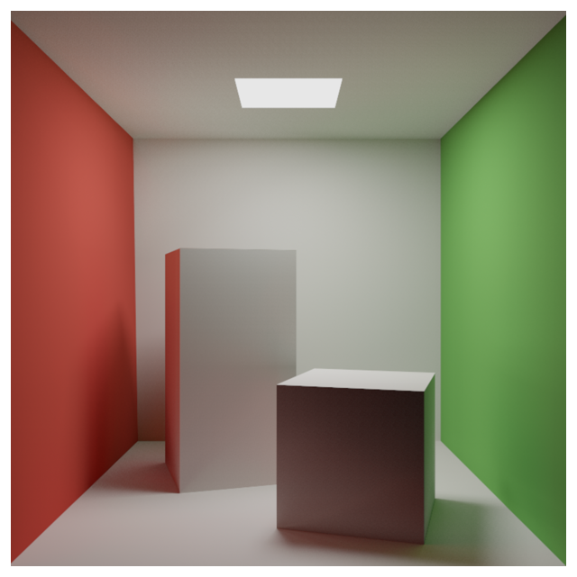

# Metal for Accelerating Ray Tracing

Use the Metal Performance Shaders ray intersector to perform ray-traced rendering.

## Overview

This sample walks you through the steps typically followed for ray tracing a scene:

1. Casting _primary rays_ from the camera to the scene and computing shading at the nearest intersection point; that is, the point nearest to the camera where a ray hits geometry.
2. Casting _shadow rays_ from the intersection point to the light source. If a shadow ray doesn't reach the light because of intersecting geometry, the intersection point is in shadow.
3. Casting _secondary rays_ from the intersection point in random directions to simulate light bouncing. Lighting contributions are added where the secondary rays intersect geometry.

Ray-tracing apps spend a significant amount of time computing ray-triangle intersections, so the efficiency of the intersection algorithm impacts rendering performance. Metal Performance Shaders solves this intersection problem with a high-performance intersector. 

The Metal Performance Shaders [MPSRayIntersector](https://developer.apple.com/documentation/metalperformanceshaders/mpsrayintersector) class accelerates ray-triangle intersection tests on the GPU. It accepts rays through a Metal buffer and returns either the closest intersection (for primary rays) or any intersection (for shadow rays) along each ray through a Metal buffer. 

Metal Performance Shaders builds a data structure called an _acceleration structure_ that optimizes computing intersections.

Metal Performance Shaders builds the acceleration structure from vertices that describe the triangles in a scene. To search for intersections, you provide the acceleration structure to an intersector.

In the real world, photons are emitted from light sources and end in the camera. Simulating real-world conditions is computationally expensive, so in this sample, rays originate from the camera.

## Cast Primary Rays



Primary rays render an image that’s equivalent to an image rendered by a rasterizer.

**Create an Intersector**

Instantiate an intersector using a [MTLDevice](https://developer.apple.com/documentation/metal/mtldevice) object:

``` objective-c
_intersector = [[MPSRayIntersector alloc] initWithDevice:_device];
```

**Create and Build an Acceleration Structure**

Create a triangle acceleration structure, specifying the device, the vertex buffer, and the number of triangles:

``` objective-c
_accelerationStructure = [[MPSTriangleAccelerationStructure alloc] initWithDevice:_device];

_accelerationStructure.vertexBuffer = _vertexPositionBuffer;
_accelerationStructure.maskBuffer = _triangleMaskBuffer;
_accelerationStructure.triangleCount = vertices.size() / 3;

[_accelerationStructure rebuild];
```

**Generate Primary Rays**

Each primary ray starts at the camera position and passes through a pixel on the image plane, resulting in one primary ray per pixel. This sample generates rays with a compute kernel that computes the origin and direction of each ray:

``` metal
// Rays start at the camera position
ray.origin = camera.position;

// Map normalized pixel coordinates into camera's coordinate system
ray.direction = normalize(uv.x * camera.right +
                          uv.y * camera.up +
                          camera.forward);
```

Assign each ray a fully white color that's scaled as light is absorbed into surfaces:

``` metal
ray.color = float3(1.0f, 1.0f, 1.0f);
```

**Intersect Rays with the Scene**

The intersector’s [encodeIntersection](https://developer.apple.com/documentation/metalperformanceshaders/mpsrayintersector/2998434-encodeintersection) method computes intersections and encodes its results to a Metal command buffer. 

For primary rays, set the intersection type so that the intersector returns the intersections that are closest to the camera ([MPSIntersectionTypeNearest](https://developer.apple.com/documentation/metalperformanceshaders/mpsintersectiontype/mpsintersectiontypenearest?language=objc)). Then pass the ray buffer containing the rays generated in the previous step, an intersection buffer to receive the intersection results, the ray count (in this case, the number of pixels), and the acceleration structure:

``` objective-c
[_intersector encodeIntersectionToCommandBuffer:commandBuffer               // Command buffer to encode into
                               intersectionType:MPSIntersectionTypeNearest  // Intersection test type
                                      rayBuffer:_rayBuffer                  // Ray buffer
                                rayBufferOffset:0                           // Offset into ray buffer
                             intersectionBuffer:_intersectionBuffer         // Intersection buffer (destination)
                       intersectionBufferOffset:0                           // Offset into intersection buffer
                                       rayCount:width * height              // Number of rays
                          accelerationStructure:_accelerationStructure];    // Acceleration structure
```

**Use the Intersection Results to Shade the Final Image**

Another compute kernel applies lighting and textures based on the intersection point and vertex attributes. This shading kernel has one thread per pixel and takes the place of the fragment shader in a rasterization workflow. Unlike with fragment shaders that interpolate vertex attributes, with a shading kernel, you do the interpolation yourself.

Intersections in the shading kernel are defined by the distance between the intersecting ray's origin and the geometry, the primitive index, and a two-element vector that represents the barycentric coordinates of the intersection on the triangle.

Use the barycentric coordinates to interpolate vertex attributes at the intersection point on a triangle. The following function returns an interpolated vertex attribute of an arbitrary type across the surface of a triangle: 

``` metal
template<typename T>
inline T interpolateVertexAttribute(device T *attributes, Intersection intersection) {
    // Barycentric coordinates sum to one
    float3 uvw;
    uvw.xy = intersection.coordinates;
    uvw.z = 1.0f - uvw.x - uvw.y;
    
    unsigned int triangleIndex = intersection.primitiveIndex;
    
    // Lookup value for each vertex
    T T0 = attributes[triangleIndex * 3 + 0];
    T T1 = attributes[triangleIndex * 3 + 1];
    T T2 = attributes[triangleIndex * 3 + 2];
    
    // Compute sum of vertex attributes weighted by barycentric coordinates
    return uvw.x * T0 + uvw.y * T1 + uvw.z * T2;
}
```

## Add Shadows



Add shadows by casting a _shadow ray_ from the intersection point to the light source. If the shadow ray doesn’t reach the light source (if some other geometry is blocking the path between the intersection and the light), that intersection point is in shadow, and you shouldn’t add its color to the image.

Shadow rays differ from primary rays in these ways: 

* They require the maximum intersection distance to avoid overshooting the light source.
* The primitive index and coordinates of the intersection are unimportant.
* They propagate the color from the shading kernel to the final kernel.

**Configure the Intersector for Shadow Rays**

You can reuse the intersector and acceleration structure you used for primary rays to compute shadow ray intersections, but you'll need to configure it to use a ray data type that supports shadow rays, based on the differences listed above. You can add your own properties to the ray structure and specify the intersector's ray stride to make the intersector skip over the additional data when reading from the ray buffer. 

Because shadows require neither a triangle index nor coordinates, set the intersector's intersection data type to [MPSIntersectionDataType.distance](https://developer.apple.com/documentation/metalperformanceshaders/mpsintersectiondatatype/distance):

``` objective-c
_intersector.intersectionDataType = MPSIntersectionDataTypeDistance;
```

**Compute the Shadow Ray Intersections**

Unlike with primary ray intersections, where you need to know the nearest surface to the camera that intersects the ray, it doesn't matter which surface intersects a shadow ray. If triangles exist between the primary intersection and the light source, the primary intersection is shadowed. Therefore, when computing shadow ray intersections, set the intersector type to [MPSIntersectionTypeAny](https://developer.apple.com/documentation/metalperformanceshaders/mpsintersectiontype/mpsintersectiontypeany?language=objc):

``` objective-c
[_intersector encodeIntersectionToCommandBuffer:commandBuffer
                               intersectionType:MPSIntersectionTypeAny
                                      rayBuffer:_shadowRayBuffer
                                rayBufferOffset:0
                             intersectionBuffer:_intersectionBuffer
                       intersectionBufferOffset:0
                                       rayCount:width * height
                          accelerationStructure:_accelerationStructure];
```

**Add the Shadows**

The shadow kernel, like the shading kernel, has one thread per pixel. If the shadow ray’s intersection distance is negative, it means the intersection point wasn't in shadow (it reached the light source). The kernel adds the color propagated from the shading kernel to the output:

``` metal
kernel void shadowKernel(uint2 tid [[thread_position_in_grid]],
                         constant Uniforms & uniforms,
                         device Ray *shadowRays,
                         device float *intersections,
                         texture2d<float, access::read> srcTex,
                         texture2d<float, access::write> dstTex)
{
    if (tid.x < uniforms.width && tid.y < uniforms.height) {
        unsigned int rayIdx = tid.y * uniforms.width + tid.x;
        device Ray & shadowRay = shadowRays[rayIdx];
        
        // Use the MPSRayIntersection intersectionDataType property to return the
        // intersection distance for this kernel only. You don't need the other fields, so
        // you'll save memory bandwidth.
        float intersectionDistance = intersections[rayIdx];
        
        float3 color = srcTex.read(tid).xyz;
        
        // If the shadow ray wasn't disabled (max distance >= 0) and it didn't hit anything
        // on the way to the light source, add the color passed along with the shadow ray
        // to the output image.
        if (shadowRay.maxDistance >= 0.0f && intersectionDistance < 0.0f)
            color += shadowRay.color;
        
        // Write result to render target
        dstTex.write(float4(color, 1.0f), tid);
    }
}
```

## Simulate Light Bouncing with Secondary Rays



Secondary rays simulate light bouncing around the scene, adding diffuse reflected light to areas in shadow. This effect is difficult to simulate with a rasterizer, but simple with a ray tracer. You can implement secondary rays by looping over the kernels, applying a random direction to rays with each iteration.

This sample chooses a random direction for each secondary ray with a probability proportional to the cosine (dot product) of the angle between the sample direction and surface normal. This sampling strategy reduces the amount of noise in the output image.

The `sampleCosineWeightedHemisphere` function uses the inversion method to map two uniformly random numbers to a three-dimensional unit hemisphere. The probability of a given sample is proportional to the cosine of the angle between the sample direction and the "up" direction `(0, 1, 0)`.

``` metal
inline float3 sampleCosineWeightedHemisphere(float2 u) {
    float phi = 2.0f * M_PI_F * u.x;
    
    float cos_phi;
    float sin_phi = sincos(phi, cos_phi);
    
    float cos_theta = sqrt(u.y);
    float sin_theta = sqrt(1.0f - cos_theta * cos_theta);
    
    return float3(sin_theta * cos_phi, cos_theta, sin_theta * sin_phi);
}
```
